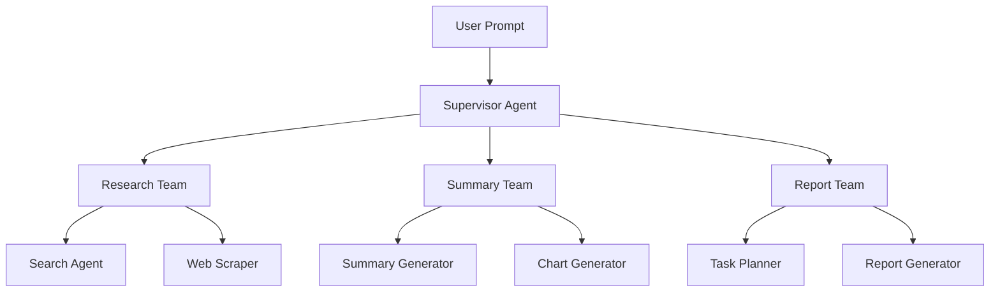

# 🧠 Multi-Agent Workflow Framework

This repo demonstrates how to build a modular **Multi-Agent System** using `LangGraph`, `LangChain`, and `LLM Orchestration`.

## 🚀 What It Does

It automates an end-to-end pipeline using AI agents that can:
- 🔍 Research topics using live search & scraping
- 📝 Summarize insights clearly with optional visual charts
- 📊 Generate reports (DOCX, PDF, or PPTX) with tactical plans

---

## 🧱 Architecture Overview

Each team is routed by its **own supervisor**, and all report back to the top-level `teams_supervisor_node`.

---

## ⚒️ Tools Used

| Tool Type         | Tech Used                    |
|------------------|------------------------------|
| Web Search        | Tavily, SerpAPI, DuckDuckGo |
| Scraping          | Requests + BeautifulSoup     |
| Chart Generation  | Matplotlib via Python REPL   |
| Report Generation | python-docx, fpdf, pptx      |
| Agent Framework   | LangGraph + LangChain        |

---
